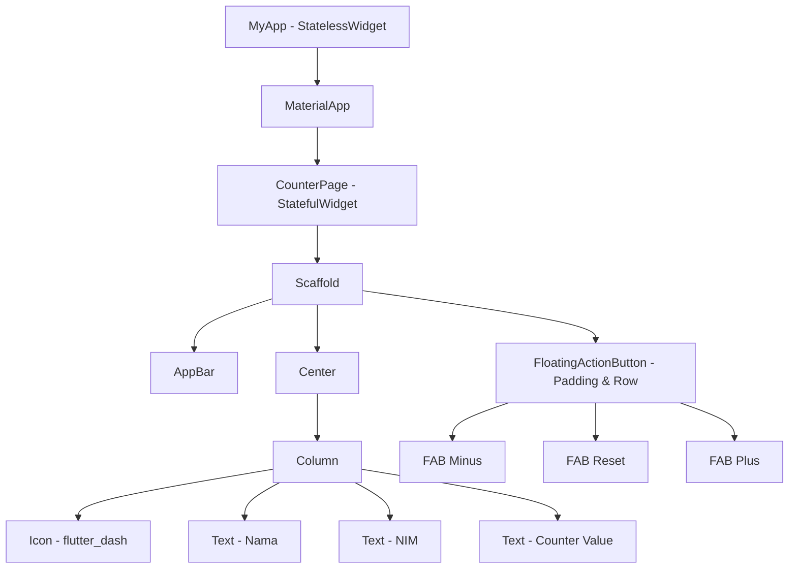

# Dokumentasi Praktikum Flutter - Pertemuan 1
**Pengenalan Flutter, Instalasi, dan Aplikasi Pertama**

---

## 📋 Informasi Praktikum
- **Topik**: Pengenalan Flutter SDK, Widget Dasar, StatelessWidget, StatefulWidget, dan Interaktivitas.
- **Nama Mahasiswa**: Dafa Rafi Nurwansyah
- **NIM**: 20240801157
- **Program Studi**: Teknik Informatika

---

## 🎯 Tujuan Pembelajaran
1. Memahami konsep dasar framework Flutter dan bahasa pemrograman Dart.
2. Memahami perbedaan antara pengembangan native dan multiplatform (cross-platform).
3. Memahami struktur folder proyek Flutter serta fungsi masing-masing berkas.
4. Memahami konsep widget tree dan hierarki UI di Flutter.
5. Memahami perbedaan mendasar antara `StatelessWidget` dan `StatefulWidget`.
6. Mampu memanfaatkan `setState()` untuk mengelola state lokal sederhana.
7. Memanfaatkan fitur Hot Reload dan Hot Restart untuk efisiensi pengembangan.

---

## 📂 Struktur Berkas & Direktori

```text
lib/pertemuan1/
├── pertemuan1.dart  # Kode utama praktikum (Counter dengan modifikasi AppBar & 3 FAB)
├── latihan.dart     # Kode latihan mandiri (Tombol Tambah, Kurang, dan Reset Counter)
├── tugas.dart       # Kode tugas mandiri (Kartu Perkenalan Profil Mahasiswa)
├── modul/
│   └── modul-praktikum-flutter-pertemuan-1.pdf
└── docs/
    └── README.md    # Dokumentasi lengkap Pertemuan 1
```

---

## 🧠 Ringkasan Teori & Konsep Kunci

### 1. Apa itu Flutter & Dart?
- **Flutter**: UI toolkit open-source dari Google untuk membuat aplikasi terkompilasi secara native pada platform mobile (Android & iOS), web, dan desktop hanya dari satu basis kode (*single codebase*).
- **Dart**: Bahasa pemrograman berorientasi objek berbasis class dengan *sound null-safety* yang digunakan sebagai bahasa resmi dalam Flutter.

### 2. Widget Tree (Pohon Widget)
Semua elemen visual pada Flutter adalah **Widget**. Struktur tampilan dibangun dengan menyusun widget secara hierarkis (widget tree).



### 3. StatelessWidget vs StatefulWidget
- **StatelessWidget**: Widget statis atau immutable yang tampilannya tidak bergantung pada perubahan data internal setelah dirender. Contoh: `Icon`, `Text`.
- **StatefulWidget**: Widget dinamis yang menyimpan state mutable melalui class `State`. Ketika state mengalami perubahan via fungsi `setState()`, Flutter akan menjalankan ulang method `build()` untuk memperbarui tampilan UI.

### 4. Hot Reload vs Hot Restart
- **Hot Reload** (`r`): Menyuntikkan berkas kode sumber yang baru diperbarui ke dalam Dart Virtual Machine (VM) yang sedang berjalan tanpa mengubah status state saat itu (*preserves state*).
- **Hot Restart** (`R`): Memuat ulang seluruh aplikasi dari awal dan mengatur ulang seluruh state ke kondisi default (*destroys state*).

---

## 🔍 Pembahasan Rinci Berkas Kode

### 1. `pertemuan1.dart` & `latihan.dart` (Aplikasi Counter Interaktif)
Berkas `pertemuan1.dart` dan `latihan.dart` mengimplementasikan checkpoint Bagian F sekaligus menyelesaikan Latihan Mandiri 1–3 pada modul.

#### Fitur Utama:
1. **AppBar Kustom**: Memiliki warna latar oranye hangat (`Color.fromARGB(255, 247, 175, 67)`) dengan judul teks tebal hitam.
2. **Body Terpusat (Center & Column)**:
   - Ikon Flutter Dash berwarna biru berukuran 80 (`Icons.flutter_dash`).
   - Teks perkenalan nama dan NIM mahasiswa.
   - Teks angka counter berukuran font 48.
3. **FloatingActionButton Bertingkat (Row FAB)**:
   - **Tombol Kurang (`Icons.remove`)**: Mengurangi nilai `_count` sebesar 1.
   - **Tombol Reset (`Icons.refresh`)**: Mengembalikan nilai `_count` ke angka 0.
   - **Tombol Tambah (`Icons.add`)**: Menambah nilai `_count` sebesar 1.

#### Cuplikan Kode Penting:
```dart
class _CounterPageState extends State<CounterPage> {
  int _count = 0;

  @override
  Widget build(BuildContext context) {
    return Scaffold(
      appBar: AppBar(
        title: const Text('Counter Saya'),
        backgroundColor: const Color.fromARGB(255, 247, 175, 67),
        titleTextStyle: const TextStyle(
          color: Colors.black,
          fontSize: 20,
          fontWeight: FontWeight.bold,
        ),
      ),
      body: Center(
        child: Column(
          mainAxisAlignment: MainAxisAlignment.center,
          children: [
            const Icon(Icons.flutter_dash, size: 80, color: Colors.blue),
            const SizedBox(height: 16),
            const Text('Halo, nama saya Dafa', style: TextStyle(fontSize: 24)),
            const Text('NIM: 20240801157', style: TextStyle(fontSize: 18)),
            const SizedBox(height: 30),
            Text('$_count', style: const TextStyle(fontSize: 48)),
          ],
        ),
      ),
      floatingActionButton: Padding(
        padding: const EdgeInsets.only(bottom: 40),
        child: Row(
          mainAxisSize: MainAxisSize.min,
          children: [
            FloatingActionButton(
              onPressed: () => setState(() => _count--),
              backgroundColor: const Color.fromARGB(255, 247, 175, 67),
              child: const Icon(Icons.remove),
            ),
            const SizedBox(width: 10),
            FloatingActionButton(
              onPressed: () => setState(() => _count = 0),
              backgroundColor: const Color.fromARGB(255, 247, 175, 67),
              child: const Icon(Icons.refresh),
            ),
            const SizedBox(width: 10),
            FloatingActionButton(
              onPressed: () => setState(() => _count++),
              backgroundColor: const Color.fromARGB(255, 247, 175, 67),
              child: const Icon(Icons.add),
            ),
          ],
        ),
      ),
    );
  }
}
```

---

### 2. `tugas.dart` (Aplikasi Kartu Perkenalan)
Berkas `tugas.dart` memenuhi instruksi Tugas Praktikum Pertemuan 1, yaitu membangun antarmuka kartu perkenalan satu halaman yang memuat profil mahasiswa.

#### Fitur Utama:
- Menggunakan `StatelessWidget` karena tidak memerlukan pembaruan state dinamis.
- Menggunakan `Scaffold` dengan `AppBar` bertuliskan "Kartu Perkenalan".
- Layout tersusun vertikal menggunakan `Column` dengan perataan tengah (`MainAxisAlignment.center`).
- Menampilkan:
  - Avatar Akun berukuran 120 (`Icons.account_circle`).
  - Nama Mahasiswa: **Dafa Rafi Nurwansyah** (Font tebal, ukuran 24).
  - NIM Mahasiswa: **20240801157**.
  - Program Studi: **Teknik Informatika**.
- Spasi visual antar elemen diatur menggunakan `SizedBox(height: ...)`.

#### Cuplikan Kode Penting:
```dart
class KartuPerkenalanApp extends StatelessWidget {
  const KartuPerkenalanApp({super.key});

  @override
  Widget build(BuildContext context) {
    return MaterialApp(
      debugShowCheckedModeBanner: false,
      home: Scaffold(
        appBar: AppBar(
          title: const Text('Kartu Perkenalan'),
        ),
        body: Center(
          child: Column(
            mainAxisAlignment: MainAxisAlignment.center,
            children: const [
              Icon(Icons.account_circle, size: 120),
              SizedBox(height: 20),
              Text(
                'Dafa Rafi Nurwansyah',
                style: TextStyle(fontSize: 24, fontWeight: FontWeight.bold),
              ),
              SizedBox(height: 10),
              Text('NIM: 20240801157', style: TextStyle(fontSize: 18)),
              SizedBox(height: 10),
              Text('Teknik Informatika', style: TextStyle(fontSize: 18)),
            ],
          ),
        ),
      ),
    );
  }
}
```

---

## ❓ Jawaban Pertanyaan Refleksi Modul

### 1. Apa perbedaan `StatelessWidget` dan `StatefulWidget`?
- **StatelessWidget**: Digunakan untuk elemen UI statis yang tidak pernah berubah setelah dibuat. Tampilannya hanya bergantung pada data konfigurasi yang dioper lewat constructor.
- **StatefulWidget**: Digunakan untuk elemen UI interaktif yang dapat berubah sewaktu-waktu selama siklus hidup aplikasi (misalnya input teks, counter, toggle status, atau data dinamis dari jaringan). StatefulWidget memisahkan konfigurasi widget dari objek `State` yang menyimpan data mutable.

### 2. Mengapa perubahan variabel `_count` perlu dibungkus `setState()`?
Jika variabel `_count` diubah secara langsung tanpa memanggil `setState()` (contoh: `_count++`), nilai variabel memang bertambah di memori, tetapi Flutter framework tidak mengetahui bahwa ada perubahan data. Pemanggilan `setState()` berfungsi sebagai sinyal yang memberitahu framework bahwa state internal telah berubah, sehingga framework menjadwalkan eksekusi ulang method `build()` untuk memperbarui tampilan layar sesuai nilai baru.

### 3. Apa keuntungan Hot Reload dibanding Rebuild penuh (Full Rebuild/Restart)?
- **Kecepatan**: Hot reload memakan waktu di bawah 1 detik karena hanya mengompilasi kode yang baru diubah lalu menginjeksinya langsung ke Dart VM yang sedang berjalan.
- **Mempertahankan State (*State Preservation*)**: Hot reload tidak menghapus nilai variabel atau kondisi layar yang sedang dibuka pengguna (misalnya form yang sedang diisi atau angka counter yang sedang berjalan tidak akan ter-reset ke nol), sehingga proses eksperimen UI dan perbaikan bug berlangsung jauh lebih cepat.

---

## 🚀 Panduan Menjalankan Berkas

Jalankan perintah berikut melalui terminal di root direktori proyek (`/home/dafarafi/pemob/praktikum`):

1. **Menjalankan Counter Page (`pertemuan1.dart` / `latihan.dart`)**:
   ```bash
   flutter run -t lib/pertemuan1/pertemuan1.dart
   ```
2. **Menjalankan Kartu Perkenalan (`tugas.dart`)**:
   ```bash
   flutter run -t lib/pertemuan1/tugas.dart
   ```
