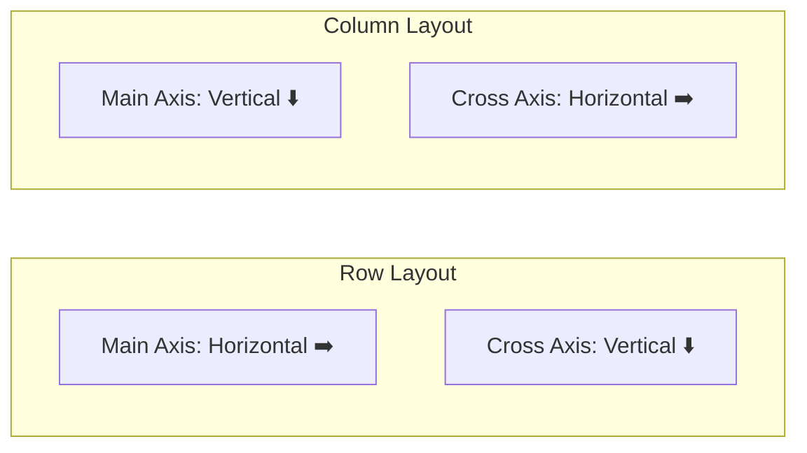
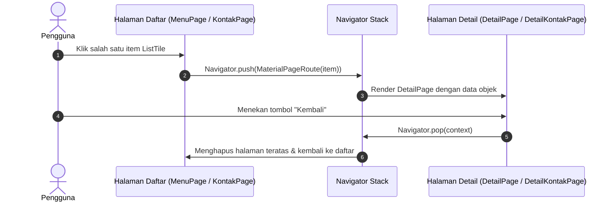

# Dokumentasi Praktikum Flutter - Pertemuan 2
**Layout, ListView, dan Navigasi Antar Halaman**

---

## 📋 Informasi Praktikum
- **Topik**: Penyusunan Tata Letak (Layouting), Pemodelan Data, Dynamic Scrolling List (`ListView.builder`), dan Navigasi Antar Halaman (`Navigator.push` & `pop`).
- **Nama Mahasiswa**: Dafa Rafi Nurwansyah
- **NIM**: 20240801157
- **Program Studi**: Teknik Informatika

---

## 🎯 Tujuan Pembelajaran
1. Mampu menyusun antarmuka kompleks memanfaatkan widget layout dasar: `Container`, `Padding`, `Row`, `Column`, dan `Expanded`.
2. Memahami konsep sumbu tata letak (*Main Axis* dan *Cross Axis*) pada `Row` dan `Column`.
3. Mencegah permasalahan *render overflow* menggunakan `Expanded`.
4. Membuat pemodelan data terstruktur menggunakan class Dart.
5. Menampilkan kumpulan data dinamis secara efisien menggunakan `ListView.builder` dan `ListTile`.
6. Menerapkan navigasi antar rute (*routing*) bertumpuk (*stack navigation*) dengan mengirimkan data objek antar halaman menggunakan `Navigator.push` dan `Navigator.pop`.

---

## 📂 Struktur Berkas & Direktori

```text
lib/pertemuan2/
├── pertemuan2.dart  # Kode Bagian A: Layout Kartu Profil (Row, Column, CircleAvatar, Container)
├── daftarmenu.dart  # Kode Aplikasi Daftar Menu Makanan & Halaman Detail
├── latihan.dart     # Kode Latihan Mandiri (Penambahan menu, format rupiah, Container kustom)
├── tugas.dart       # Kode Tugas Mandiri: Aplikasi Daftar Kontak & Detail Kontak
├── modul/
│   └── modul-praktikum-flutter-pertemuan-2.pdf
└── docs/
    └── README.md    # Dokumentasi lengkap Pertemuan 2
```

---

## 🧠 Ringkasan Teori & Konsep Kunci

### 1. Widget Layout Pokok
| Widget | Fungsi Utama |
| :--- | :--- |
| `Container` | Komponen pembungkus serbaguna untuk mengatur margin, padding, dekorasi (warna, border radius), serta dimensi. |
| `Padding` | Memberikan ruang jarak kosong di sekeliling widget anaknya. |
| `Row` | Menyusun daftar widget anak secara mendatar / horizontal. |
| `Column` | Menyusun daftar widget anak secara menurun / vertikal. |
| `Expanded` | Memaksa widget anak mengambil seluruh sisa ruang yang tersedia di sumbu utama `Row` atau `Column`. |

### 2. Sumbu Layout (Main Axis vs Cross Axis)
- **Pada `Row`**: *Main Axis* berada di arah horizontal (kiri-ke-kanan), sedangkan *Cross Axis* berada di arah vertikal (atas-ke-bawah).
- **Pada `Column`**: *Main Axis* berada di arah vertikal (atas-ke-bawah), sedangkan *Cross Axis* berada di arah horizontal (kiri-ke-kanan).



### 3. Arsitektur Navigasi dan Aliran Data
Alur perpindahan halaman menggunakan sistem *LIFO (Last In First Out)* stack navigation:



---

## 🔍 Pembahasan Rinci Berkas Kode

### 1. `pertemuan2.dart` (Layout Kartu Profil)
Mengimplementasikan kartu profil pengguna yang memadukan `Container`, dekorasi `BoxDecoration`, `Row`, `CircleAvatar`, dan `Column`.

#### Analisis Implementasi:
- `Container` menggunakan `BoxDecoration` dengan warna latar biru muda lembut (`Colors.blue.shade50`) dan sudut melengkung dengan radius 12 (`BorderRadius.circular(12)`).
- Di dalam `Row`:
  - Bagian kiri: `CircleAvatar` berukuran radius 32 berisi ikon profil `Icons.person`.
  - Jarak: `SizedBox(width: 16)`.
  - Bagian kanan: `Column` yang menyusun Nama ("Dafa Rafi") dan NIM ("20240801157") secara vertikal dengan perataan rata kiri (`crossAxisAlignment: CrossAxisAlignment.start`).

```dart
Container(
  padding: const EdgeInsets.all(16),
  decoration: BoxDecoration(
    color: Colors.blue.shade50,
    borderRadius: BorderRadius.circular(12),
  ),
  child: Row(
    children: [
      const CircleAvatar(
        radius: 32,
        child: Icon(Icons.person, size: 32),
      ),
      const SizedBox(width: 16),
      Column(
        crossAxisAlignment: CrossAxisAlignment.start,
        children: const [
          Text(
            'Dafa Rafi',
            style: TextStyle(fontSize: 20, fontWeight: FontWeight.bold),
          ),
          Text('20240801157'),
        ],
      ),
    ],
  ),
)
```

---

### 2. `daftarmenu.dart` & `latihan.dart` (Aplikasi Daftar Menu & Detail)
Berkas ini mengimplementasikan katalog makanan dan minuman yang menyelesaikan seluruh tantangan pada Latihan Mandiri 1–4:
1. **Model Data Makanan**: Menyimpan nama, harga, dan deskripsi menu.
2. **Format Mata Uang Rupiah**: Menggunakan fungsi regex custom `formatRupiah(int angka)` untuk menambahkan titik pemisah ribuan.
3. **Penambahan Menu**: Memuat 7 varian menu lengkap (Nasi Goreng, Mie Ayam, Es Teh, Ayam Bakar, Sate Ayam, Bakso, Seblak).
4. **Desain Card Kustom**: Mengganti `Card` default dengan `Container` berlatar `Colors.blue.shade50` dan radius sudut 16.
5. **Navigasi ke Halaman Detail**: Mengirim objek `Makanan` ke `DetailPage` melalui constructor untuk menampilkan detail lengkap beserta tombol kembali.

#### Cuplikan Format Rupiah & Model Data:
```dart
String formatRupiah(int angka) {
  return angka.toString().replaceAllMapped(
        RegExp(r'\B(?=(\d{3})+(?!\d))'),
        (match) => '.',
      );
}

class Makanan {
  final String nama;
  final int harga;
  final String deskripsi;

  const Makanan(this.nama, this.harga, this.deskripsi);
}
```

#### Cuplikan Navigasi ke DetailPage:
```dart
onTap: () {
  Navigator.push(
    context,
    MaterialPageRoute(
      builder: (_) => DetailPage(makanan: item),
    ),
  );
}
```

---

### 3. `tugas.dart` (Aplikasi Daftar Kontak)
Berkas ini merupakan implementasi Tugas Praktikum Pertemuan 2 dengan spesifikasi lengkap:
- **Model `Kontak`**: Memiliki properti `nama`, `nomorTelepon`, dan `email`.
- **Daftar Kontak**: Berisi 6 data kontak mahasiswa/teman (Andi Saputra, Budi Santoso, Citra Lestari, Deni Pratama, Eka Putri, Fajar Ramadhan).
- **Halaman Utama (`KontakPage`)**:
  - `ListView.builder` merender setiap baris kontak dengan `ListTile`.
  - `CircleAvatar` menampilkan inisial huruf pertama nama menggunakan `kontak.nama[0]`.
  - Menampilkan nama kontak dengan font tebal dan nomor telepon sebagai subtitle.
  - Memiliki trailing icon panah `Icons.chevron_right`.
- **Halaman Detail (`DetailKontakPage`)**:
  - Menerima parameter `required this.kontak`.
  - Menampilkan `CircleAvatar` besar (radius 50) dengan inisial berukuran font 40.
  - Baris informasi nomor telepon dan email dilengkapi dengan ikon representatif (`Icons.phone` dan `Icons.email`).
  - Tombol aksi `ElevatedButton` "Kembali" yang memanggil `Navigator.pop(context)`.

```dart
// Avatar inisial nama pada halaman daftar:
CircleAvatar(
  child: Text(kontak.nama[0]),
)

// Navigasi ke Halaman Detail Kontak:
Navigator.push(
  context,
  MaterialPageRoute(
    builder: (_) => DetailKontakPage(kontak: kontak),
  ),
);
```

---

## ❓ Jawaban Pertanyaan Refleksi Modul

### 1. Apa perbedaan `ListView` biasa dengan `ListView.builder`?
- **`ListView` biasa**: Seluruh widget anak yang didefinisikan langsung diinstansiasi dan dirender ke dalam memori secara bersamaan (*eager loading*). Cocok hanya untuk daftar dengan jumlah item sedikit dan tetap.
- **`ListView.builder`**: Menerapkan konsep *lazy loading* (on-demand rendering). Widget anak hanya dibuat ketika elemen tersebut berada atau hampir masuk ke dalam area pandang layar (*viewport*), lalu didaur ulang (*recycled*) saat keluar dari layar. Ini mencegah kehabisan memori (*memory leak/bloat*) saat menangani puluhan hingga ribuan data.

### 2. Mengapa `Row` yang berisi teks panjang dapat menyebabkan *overflow*, dan bagaimana `Expanded` membantu?
`Row` memiliki batasan lebar yang tidak terbatas (*unbounded width*) di sepanjang sumbu horizontalnya (*main axis*). Jika sebuah widget teks memiliki isi string yang melebihi lebar layar fisik perangkat, Flutter tidak dapat menghitung di mana teks harus dipotong tanpa instruksi batasan, sehingga terjadi kesalahan `A RenderFlex overflowed by ... pixels` (ditandai garis kuning-hitam di layar). Widget `Expanded` mengatasi masalah ini dengan membatasi lebar widget anak agar sesuai dengan sisa lebar yang tersedia dalam `Row` (*bounded constraint*), memungkinkan widget `Text` membungkus teksnya ke baris baru (*word wrapping*).

### 3. Bagaimana data dikirim dari halaman daftar ke halaman detail pada praktikum ini?
Pengiriman data dilakukan melalui **Constructor Injection** pada class widget tujuan. Pada halaman daftar, saat event `onTap` terpicu, objek data yang dipilih dioper ke dalam konstruktor halaman detail:
```dart
Navigator.push(
  context,
  MaterialPageRoute(
    builder: (_) => DetailPage(makanan: item),
  ),
);
```
Halaman `DetailPage` kemudian mendeklarasikan field `final Makanan makanan;` dan menerimanya melalui konstruktor `const DetailPage({super.key, required this.makanan});`.

---

## 🚀 Panduan Menjalankan Berkas

Jalankan perintah berikut melalui terminal di root direktori proyek (`/home/dafarafi/pemob/praktikum`):

1. **Menjalankan Layout Profil (`pertemuan2.dart`)**:
   ```bash
   flutter run -t lib/pertemuan2/pertemuan2.dart
   ```
2. **Menjalankan Daftar Menu Makanan (`daftarmenu.dart` / `latihan.dart`)**:
   ```bash
   flutter run -t lib/pertemuan2/daftarmenu.dart
   ```
3. **Menjalankan Aplikasi Daftar Kontak (`tugas.dart`)**:
   ```bash
   flutter run -t lib/pertemuan2/tugas.dart
   ```
