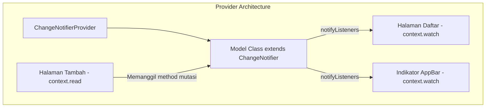

# Dokumentasi Praktikum Flutter - Pertemuan 3
**Form, Validasi, dan State Management (Provider)**

---

## 📋 Informasi Praktikum
- **Topik**: Penggunaan Formulir (`Form`, `TextFormField`, `DropdownButtonFormField`), Validasi Input, Arsitektur State Management menggunakan paket `provider` (`ChangeNotifier`, `context.watch`, `context.read`).
- **Nama Mahasiswa**: Dafa Rafi Nurwansyah
- **NIM**: 20240801157
- **Program Studi**: Teknik Informatika

---

## 🎯 Tujuan Pembelajaran
1. Memahami siklus hidup formulir Flutter menggunakan `Form` dan `GlobalKey<FormState>`.
2. Mampu membuat input teks, dropdown, dan checkbox dengan aturan validasi (*custom validator*).
3. Mengelola siklus hidup `TextEditingController` dan mencegah kebocoran memori (*memory leak*) melalui `dispose()`.
4. Memahami batasan *local state* (`setState`) dan pentingnya *global state management* untuk berbagi data antar halaman (*cross-page state*).
5. Mengimplementasikan pustaka `provider` dengan pola arsitektur `ChangeNotifier` dan `ChangeNotifierProvider`.
6. Menguasai perbedaan pemakaian `context.watch()` untuk rendering UI reaktif dan `context.read()` untuk pemanggilan aksi pada callback/event handler.

---

## 📂 Struktur Berkas & Direktori

```text
lib/pertemuan3/
├── pertemuan3.dart   # Bagian B: Form Pendaftaran dengan Validasi Lengkap & SnackBar
├── daftartugas.dart  # Bagian D: Implementasi Dasar To-do List dengan Provider
├── latihan.dart      # Latihan Mandiri: To-do List Lanjutan (Hapus Selesai, Validasi, Empty State)
├── tugas.dart        # Tugas Mandiri: Aplikasi Daftar Belanja (Shopping List) Lengkap
├── modul/
│   └── modul-praktikum-flutter-pertemuan-3.pdf
└── docs/
    └── README.md     # Dokumentasi lengkap Pertemuan 3
```

---

## 🧠 Ringkasan Teori & Konsep Kunci

### 1. Form dan Validasi Input
- **`GlobalKey<FormState>`**: Kunci unik yang memberikan akses ke status internal form untuk menjalankan validasi (`_formKey.currentState!.validate()`).
- **`validator` Callback**: Fungsi pengecekan isi field. Mengembalikan string pesan error jika nilai tidak memenuhi syarat, atau `null` jika isian valid.
- **`TextEditingController`**: Mengontrol teks yang ditampilkan, membaca nilai teks secara real-time, dan harus di-`dispose()` saat widget dilepas dari widget tree.

### 2. Kapan Menggunakan `setState` vs `Provider`?
- **Ephemeral State (Local State)**: State yang hanya dibutuhkan oleh satu widget dan tidak diperlukan oleh widget lain (contoh: status animasi, teks input saat mengetik, visibilitas password). Cukup gunakan `setState()`.
- **App State (Global/Shared State)**: State yang harus dibagikan dan dimodifikasi oleh beberapa halaman berbeda (contoh: daftar belanja, daftar keranjang, status autentikasi login, tema aplikasi). Gunakan `Provider`.

### 3. Arsitektur State Management Provider



### 4. Perbedaan `context.watch()` vs `context.read()`
| Pembeda | `context.watch<T>()` | `context.read<T>()` |
| :--- | :--- | :--- |
| **Tujuan** | Mendengarkan perubahan data model. | Mengakses model hanya untuk memanggil method atau membaca data sekali. |
| **Reaktif** | Ya, menyebabkan widget di-rebuild saat model memanggil `notifyListeners()`. | Tidak, widget tidak akan di-rebuild ketika data model berubah. |
| **Lokasi Penggunaan** | Hanya boleh digunakan langsung di dalam method `build()`. | Digunakan di dalam event handler / callback (misal: `onPressed`, `onSubmitted`). |

---

## 🔍 Pembahasan Rinci Berkas Kode

### 1. `pertemuan3.dart` (Form Pendaftaran dengan Validasi)
Mengimplementasikan formulir pendaftaran mahasiswa dengan validasi input yang aman dan interaktif:

#### Fitur & Validasi:
1. **Validasi Nama**: Field nama wajib diisi dan tidak boleh hanya berisi karakter spasi kosong.
2. **Validasi Email**: Field email wajib diisi dan harus memuat simbol `@`. Menggunakan tipe keyboard `TextInputType.emailAddress`.
3. **Dropdown Jurusan**: Menyediakan opsi pilihan 'Teknik Informatika' (TI) dan 'Sistem Informasi' (SI) dengan validasi wajib pilih.
4. **Checkbox Persetujuan**: Menggunakan `CheckboxListTile`. Tombol "Daftar" otomatis berstatus `disabled` (`null`) sampai pengguna mencentang persetujuan.
5. **Feedback SnackBar**: Menampilkan pesan keberhasilan registrasi dengan informasi nama dan jurusan yang didaftarkan.

#### Cuplikan Validasi & Pengiriman Form:
```dart
void _kirim() {
  if (_formKey.currentState!.validate()) {
    final jurusan = _jurusan ?? '-';
    ScaffoldMessenger.of(context).showSnackBar(
      SnackBar(content: Text('Terdaftar: ${_nama.text} ($jurusan)')),
    );
  }
}
```

---

### 2. `latihan.dart` & `daftartugas.dart` (Aplikasi To-do List dengan Provider)
Menerapkan manajemen state terpusat untuk aplikasi To-do List dan menyelesaikan seluruh tantangan Latihan Mandiri 1–4:

#### Fitur & Analisis Kode:
1. **Model & ChangeNotifier (`TugasModel`)**:
   - `_items`: List penyimpan kumpulan objek `Tugas(judul, selesai)`.
   - `items`: Getter yang dibungkus `List.unmodifiable(_items)` guna menjaga immutabilitas dari modifikasi langsung di luar class.
   - `jumlahSelesai`: Menghitung tugas selesai dengan `_items.where((t) => t.selesai).length`.
   - Method mutasi yang memanggil `notifyListeners()`: `tambah()`, `toggle()`, `hapus()`, dan `hapusSelesai()`.
2. **AppBar Interaktif**:
   - Menampilkan rasio penyelesaian tugas (`${model.jumlahSelesai}/${model.items.length}`).
   - Tombol hapus massal (`Icons.delete_sweep`) yang nonaktif jika belum ada tugas yang selesai (`model.jumlahSelesai == 0 ? null : ...`).
3. **Validasi Tambah Tugas**:
   - Menggunakan `Form` dan `TextFormField` dengan validasi minimal 3 karakter.
4. **Empty State & Notifikasi**:
   - Menampilkan teks *"Belum ada tugas"* saat list kosong.
   - Menampilkan SnackBar *"Tugas ditambahkan"* setelah tugas berhasil disimpan.

```dart
class TugasModel extends ChangeNotifier {
  final List<Tugas> _items = [];
  List<Tugas> get items => List.unmodifiable(_items);

  int get jumlahSelesai => _items.where((t) => t.selesai).length;

  void tambah(String judul) {
    _items.add(Tugas(judul));
    notifyListeners();
  }

  void toggle(int index) {
    _items[index].selesai = !_items[index].selesai;
    notifyListeners();
  }

  void hapusSelesai() {
    _items.removeWhere((tugas) => tugas.selesai);
    notifyListeners();
  }
}
```

---

### 3. `tugas.dart` (Aplikasi Daftar Belanja / Shopping List)
Berkas ini merupakan implementasi Tugas Praktikum Pertemuan 3 dengan kriteria terlengkap:

#### 1. Pemodelan Data & Model State:
- **Class `Barang`**: Menyimpan `nama`, `jumlah`, `kategori`, dan status boolean `sudahDibeli`.
- **Class `BelanjaModel extends ChangeNotifier`**:
  - Menyimpan koleksi barang belanjaan secara terenkapsulasi.
  - Getter `jumlahBelumDibeli`: Menghitung barang yang nilai `sudahDibeli == false` untuk judul AppBar.
  - Method `tambahBarang()`, `toggleDibeli(index)`, dan `hapusBarang(index)` yang selalu mengeksekusi `notifyListeners()`.

#### 2. Halaman Daftar (`DaftarPage`):
- Menggunakan `context.watch<BelanjaModel>()` untuk me-render data terkini.
- Judul AppBar dinamis menampilkan: `Daftar Belanja (${model.jumlahBelumDibeli})`.
- Bila belum ada data, menampilkan pesan *Center Text* "Belum ada barang".
- Setiap baris menampilkan:
  - Checkbox penanda status dibeli.
  - Teks nama barang dengan efek garis coret (*strikethrough*) jika status `sudahDibeli` bernilai true.
  - Keterangan jumlah dan kategori barang sebagai subjudul.
  - Tombol ikon hapus (`Icons.delete`).

#### 3. Halaman Form Tambah Barang (`TambahBarangPage`):
- **Validasi Nama Barang**: Wajib diisi dan tidak boleh spasi kosong.
- **Validasi Jumlah Barang**: Wajib diisi, harus berupa angka bulat yang valid (`int.tryParse`), dan harus bernilai lebih dari 0.
- **Validasi Kategori**: Dropdown menu dengan 5 opsi kategori (*Makanan*, *Minuman*, *Kebutuhan Rumah*, *Elektronik*, *Lainnya*) dengan validasi wajib pilih.
- Setelah submit berhasil, halaman ditutup dengan `Navigator.pop(context, true)` dan SnackBar konfirmasi dimunculkan di halaman utama.

#### Cuplikan Validasi Jumlah & Form Submit:
```dart
validator: (value) {
  if (value == null || value.trim().isEmpty) {
    return 'Jumlah wajib diisi';
  }
  final jumlah = int.tryParse(value.trim());
  if (jumlah == null) {
    return 'Jumlah harus berupa angka';
  }
  if (jumlah <= 0) {
    return 'Jumlah harus lebih dari 0';
  }
  return null;
}
```

---

## ❓ Jawaban Pertanyaan Refleksi Modul

### 1. Mengapa `TextEditingController` harus di-`dispose()`?
Objek `TextEditingController` mendaftarkan listener tingkat rendah (*low-level platform channels*) ke mesin Flutter untuk memantau perubahan teks, posisi kursor, dan seleksi keyboard. Jika controller tidak dilepas melalui `dispose()` ketika widget stateful dihapus dari widget tree (misalnya saat pengguna keluar dari halaman form), alokasi memori untuk objek controller dan listener tersebut akan tetap bertahan (*memory leak*). Dalam jangka panjang, hal ini dapat menurunkan performa aplikasi dan berisiko memicu error runtime karena memanipulasi controller yang sudah *unmounted*.

### 2. Kapan cukup memakai `setState`, dan kapan sebaiknya beralih ke `Provider`?
- **Cukup memakai `setState`**: Saat mengelola data lokal (*ephemeral state*) yang ruang lingkupnya terbatas pada satu widget tampilan saja dan tidak perlu diketahui oleh widget di halaman lain (contoh: status animasi, teks pada form sebelum dikirim, atau status checkbox persetujuan syarat ketentuan).
- **Beralih ke `Provider`**: Saat mengelola data bersama (*app state*) yang dibutuhkan atau dimodifikasi oleh berbagai widget di beberapa halaman yang terpisah jauh dalam widget tree (contoh: keranjang belanja, status login pengguna, preferensi tema aplikasi, atau sinkronisasi data antar halaman daftar dan form tambah).

### 3. Apa yang terjadi bila `notifyListeners()` lupa dipanggil? Mengapa?
Jika `notifyListeners()` tidak dipanggil setelah kita memodifikasi data model, data di dalam objek memori sebenarnya sudah berubah, namun framework Flutter tidak mengetahui bahwa perubahan tersebut telah terjadi. Widget yang mengamati model melalui `context.watch()` atau `Consumer` tidak akan menerima notifikasi pembaruan, sehingga method `build()` tidak akan dijalankan ulang (*rebuild*) dan antarmuka layar pengguna (UI) akan tetap membeku (*freeze*) pada tampilan data yang lama.

### 4. Mengapa di dalam `onPressed` kita memakai `context.read`, bukan `context.watch`?
- `context.watch<T>()` berfungsi untuk membuat widget berlangganan (*subscribe*) pada perubahan model `T`. Penggunaan `watch` hanya valid di dalam method `build()`. Jika dipanggil di dalam callback seperti `onPressed`, Flutter akan memicu exception karena operasi pemanggilan listener tidak boleh didaftarkan di luar fase build.
- `context.read<T>()` hanya mengambil referensi objek model satu kali pada saat tombol ditekan tanpa mendaftarkan widget sebagai pendengar perubahan. Hal ini memastikan aksi mutasi (seperti menambah data atau menghapus item) berjalan efisien tanpa memicu rebuild yang tidak perlu pada widget tombol itu sendiri.

---

## 🚀 Panduan Menjalankan Berkas

Jalankan perintah berikut melalui terminal di root direktori proyek (`/home/dafarafi/pemob/praktikum`):

1. **Menjalankan Form Pendaftaran (`pertemuan3.dart`)**:
   ```bash
   flutter run -t lib/pertemuan3/pertemuan3.dart
   ```
2. **Menjalankan Aplikasi To-do List Provider (`latihan.dart` / `daftartugas.dart`)**:
   ```bash
   flutter run -t lib/pertemuan3/latihan.dart
   ```
3. **Menjalankan Aplikasi Daftar Belanja Provider (`tugas.dart`)**:
   ```bash
   flutter run -t lib/pertemuan3/tugas.dart
   ```
   *(Atau secara default via `lib/main.dart` yang juga menjalankan aplikasi Daftar Belanja ini)*.
